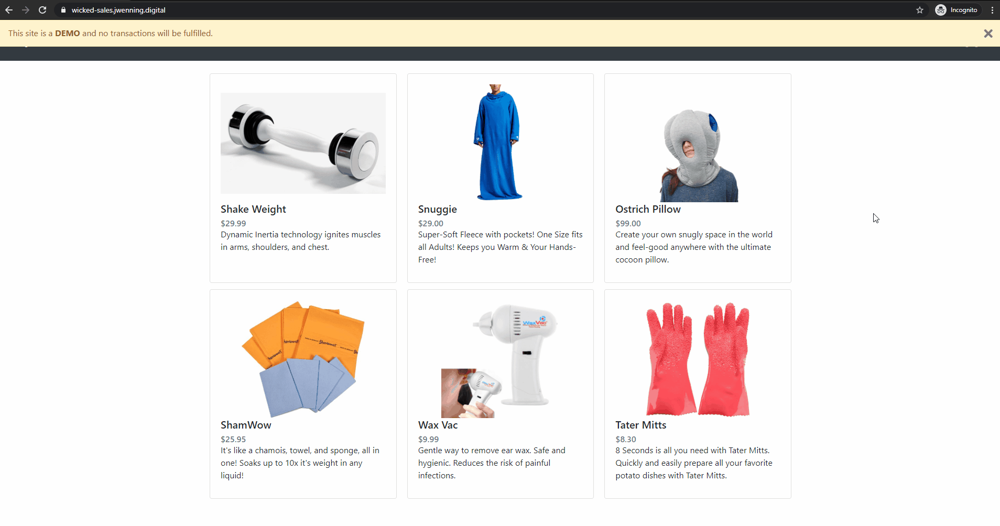
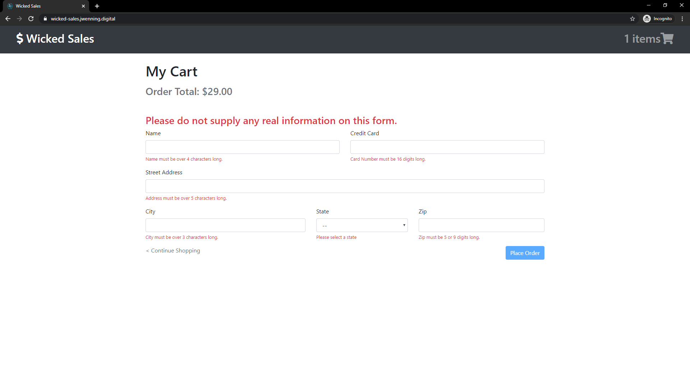
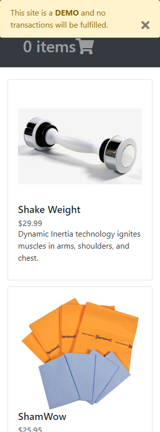
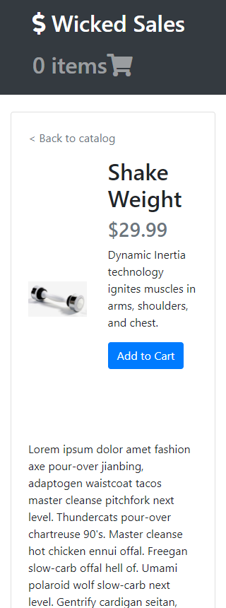
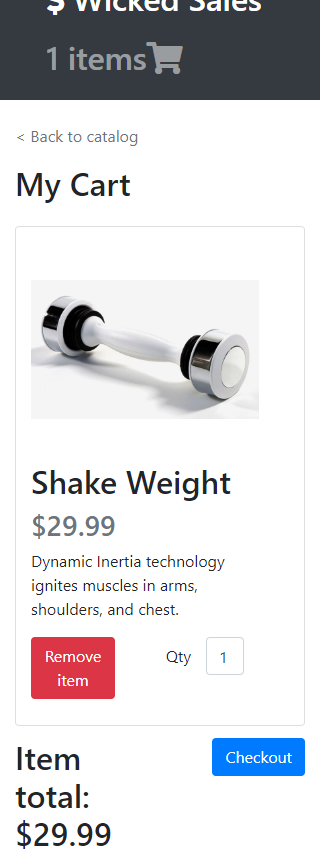
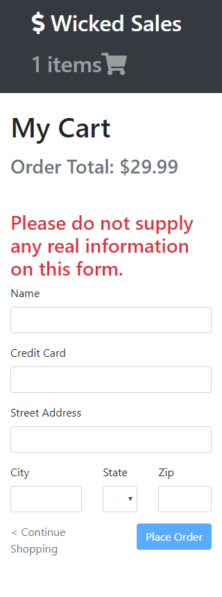

# Wicked Sales

A full stack Content Management System (CMS) web application for consumers who want to buy novelty items.

## Technologies Used

- React.js
- Webpack 4
- Bootstrap 4
- PostgreSQL 10.10
- HTML5
- CSS3

## Live Demo

Try the application live at https://wicked-sales.jwenning.digital.

## Features

- Guest can view product catalogue
- Guest can view product details
- Guest can add product to cart
- Guest can view cart
- Guest can remove product from cart
- Guest can modify product in cart
- Guest can view checkout
- Guest can check out

## Previews

## Development

#### System Requirements
- Node.js 10.15.3+
- npm 6.14.2
- PostgreSQL 10.10+

#### Getting Started

1. Clone the repository.

        git clone https://github.com/j-wenning/wicked-sales.git
        cd wicked-sales

2. Install dependencies with NPM

        npm install

3. Import example database to Postgres with NPM.

        npm run db:import

4. Start the project.

        npm run dev

    You can view the application by opening http://localhost:3000 in your browser!
